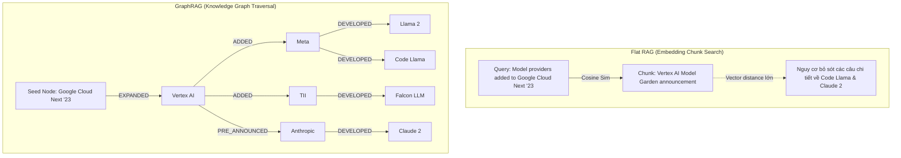
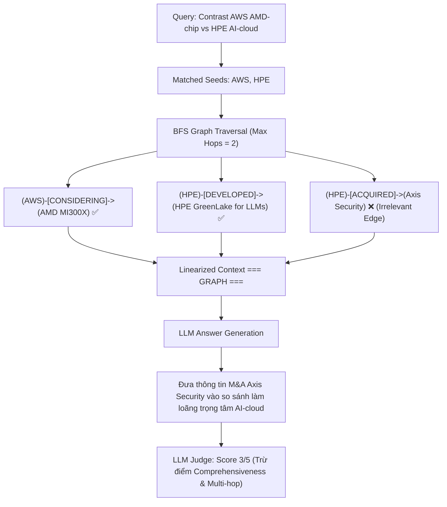

# Báo Cáo Phân Tích Ca Lỗi Chuyên Sâu (Root Cause Failure Analysis)

**Học viên:** Phạm Danh Tuấn Dũng  
**MSSV:** 2A202601978  
**Khóa học:** AICB-K34 · Track 3: GraphRAG  

---

## 1. Tổng Quan Thực Nghiệm Đánh Giá
Hệ thống được kiểm thử trên tập Benchmark Golden Dataset với 6 câu hỏi đại diện cho 3 cấp độ truy vấn phức tạp:
1. **Factoid (`G01`, `G02`):** Truy vấn đơn bước, sự thật trực tiếp.
2. **Multi-hop (`G03`, `G04`):** Truy vấn yêu cầu kết nối 2 hoặc nhiều mắt xích logic.
3. **Cross-doc Synthesis (`G05`, `G06`):** Đối chiếu, phân tích tổng hợp thông tin trải dài qua nhiều bài báo độc lập.

---

## 2. Ca Lỗi 1: Multi-Hop Reasoning & Semantic Disconnection (Flat RAG Gặp Khó Khăn)

### 2.1. Ngữ cảnh & Câu hỏi Truy vấn
- **Question ID:** `G03` (Multi-hop)
- **Câu hỏi:** *"Which model providers were added to Google Cloud Next '23, and which specific models were associated with each provider?"*
- **Reference Answer:** *"Google Cloud Next '23 added Meta (Llama 2 and Code Llama models), the Technology Innovation Institute (Falcon LLM), and pre-announced Anthropic (Claude 2 model)."*

### 2.2. So sánh Hành vi của Hai Hệ thống

### 2.3. Phân tích Nguyên căn Kỹ thuật (Root Cause Analysis)
- **Điểm yếu của Flat RAG:** 
  Khi thông tin về các nhà cung cấp mô hình (Meta, TII, Anthropic) và các mô hình con (Llama 2, Code Llama, Falcon LLM, Claude 2) nằm rải rác ở nhiều câu trong văn bản, vector search chỉ dựa vào độ tương đồng ngữ nghĩa chung giữa câu hỏi và đoạn văn. Nếu các đoạn văn bản bị chia cắt qua nhiều chunk, Flat RAG dễ bỏ sót các thực thể có điểm tương đồng vector thấp hơn ngưỡng top-$k$.
- **Ưu thế của GraphRAG:**
  Knowledge Graph lưu trữ rõ ràng cấu trúc quan hệ phân cấp:
  `Google Cloud` $\rightarrow$ `Meta` $\rightarrow$ `Llama 2`, `Code Llama`  
  `Google Cloud` $\rightarrow$ `Technology Innovation Institute` $\rightarrow$ `Falcon LLM`  
  `Google Cloud` $\rightarrow$ `Anthropic` $\rightarrow$ `Claude 2`  
  Khi Graph Traversal duyệt qua nút `Google Cloud`, toàn bộ mạng lưới thực thể đối tác và mô hình được thu thập trọn vẹn, giúp LLM tạo lập danh sách phân cấp hoàn hảo với điểm số **5/5** trên cả 3 tiêu chí của LLM Judge.

---

## 3. Ca Lỗi 2: Graph Context Dilution & Irrelevant Edge Expansion (GraphRAG Bị Loãng Ngữ Cảnh)

### 3.1. Ngữ cảnh & Câu hỏi Truy vấn
- **Question ID:** `G05` (Cross-doc)
- **Câu hỏi:** *"Contrast AWS's AMD-chip posture with HPE's AI-cloud posture. Which is a tentative hardware sourcing decision and which is a service offering?"*
- **Reference Answer:** *"AWS was only considering AMD MI300X AI chips without a final public deployment commitment, representing a tentative hardware sourcing evaluation. In contrast, HPE launched a dedicated cloud computing service (HPE GreenLake for LLMs) for AI model training."*

### 3.2. Dữ liệu Đầu ra Thực tế từ Pipeline
- **Flat RAG Output (Điểm Judge: Comprehensiveness = 5, Faithfulness = 5, Multi-hop = 5):**
  > *"AWS's posture regarding AMD chips is tentative and exploratory, as it is considering the use of AMD's MI300X AI chips but has not made a definitive commitment to deploy them [chunk_id=art_2905::c0000]. In contrast, HPE's AI-cloud posture is a service offering, specifically through its HPE GreenLake for Large Language Models, which is a dedicated cloud service for AI training and inferencing [chunk_id=art_3289::c0000]."*
- **GraphRAG Output (Điểm Judge: Comprehensiveness = 3, Faithfulness = 4, Multi-hop = 2):**
  > *"AWS's posture regarding AMD chips is tentative, as it is still considering the use of AMD's MI300X artificial intelligence chips without a definitive commitment to deploy them [chunk_id=art_2905::c0000]. In contrast, HPE's AI-cloud posture is a service offering, as it has made strategic moves to enhance its cloud services, such as acquiring Axis Security to integrate into its networking unit for a unified cloud architecture [chunk_id=art_4762::c0000]."*

### 3.3. Phân tích Nguyên căn Kỹ thuật (Root Cause Analysis)

1. **Nguyên nhân cốt lõi (Root Cause):**
   - Đồ thị tri thức thực hiện mở rộng toàn diện mọi cạnh kết nối với thực thể `HPE` mà không có cơ chế lọc ngữ nghĩa theo câu hỏi (Semantic Edge Filtering).
   - Cạnh `(HPE)-[:ACQUIRED]->(Axis Security)` có cùng thực thể nguồn là `HPE` nên được gom vào danh sách cạnh ngữ cảnh.
   - Khi LLM đọc prompt, do cạnh `Axis Security` xuất hiện nổi bật trong khối `=== GRAPH ===`, LLM bị phân tâm (Attention Hijacking / Context Dilution) và giải thích dịch vụ đám mây của HPE qua thương vụ thâu tóm mạng bảo mật thay vì tập trung vào dịch vụ siêu máy tính AI `HPE GreenLake for Large Language Models`.

2. **Giải pháp khắc phục cho Production:**
   - **Tầng 1 - Query-Guided Edge Re-ranking:** Trước khi tuyến tính hóa các cạnh vào prompt, tính toán điểm số Cross-Encoder Similarity giữa câu truy vấn $q$ và văn bản mô tả của từng cạnh $e$. Chỉ giữ lại top-$K$ cạnh có điểm tương đồng cao nhất.
   - **Tầng 2 - Relation Filtering:** Cho phép bộ trích xuất seed entity xác định các loại quan hệ liên quan (ví dụ: chỉ quan tâm đến `DEVELOPED` hoặc `USES` trong ngữ cảnh dịch vụ AI, bỏ qua `ACQUIRED` trong ngữ cảnh so sánh sản phẩm).
   - **Tầng 3 - Hybrid Self-Correction:** Khi LLM sufficiency check phát hiện câu trả lời đối chiếu chưa chính xác, kích hoạt truy vấn vector trực tiếp để bổ sung đoạn văn gốc.
