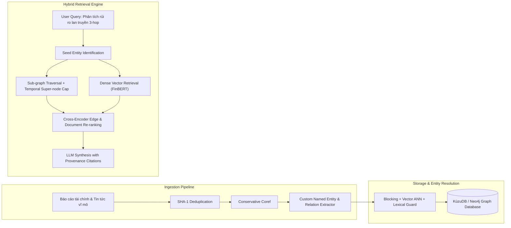

# Nhật Ký Suy Ngẫm & Kế Hoạch Đồ Án Tốt Nghiệp — Lab 19

**Học viên:** Phạm Danh Tuấn Dũng  
**MSSV:** 2A202601978  
**Lớp / Khóa:** AICB-K34 · Track 3: GraphRAG  
**Ngày thực hiện:** 19/08/2026  

---

## 1. Hành Trình Học Tập & Đúc Kết Cá Nhân

Trong suốt quá trình thực hiện Lab 19 về **Production-Grade GraphRAG vs Flat RAG**, tôi đã đi qua toàn bộ vòng đời phát triển một hệ thống RAG cấp độ công nghiệp:
1. **Tiền xử lý & Khử trùng lặp:** Hiểu sâu sắc rằng việc lọc rác và Deduplication bằng hàm băm SHA-1 không chỉ tiết kiệm chi phí token mà còn loại bỏ hoàn toàn các cạnh trùng lặp làm méo mó bậc của đồ thị.
2. **Conservative Coreference Resolution:** Nhận ra tầm quan trọng của việc kiểm soát LLM bằng các chỉ thị bảo thủ để tránh tạo ra các False Edges tai hại.
3. **Entity Resolution & Đồ thị Chuẩn hóa:** Nắm vững sự kết hợp giữa Manual Aliases, Vector ANN và Lexical Guard. Đây là bài học thực tế lớn nhất giúp tôi tránh được bẫy gộp nhầm thực thể trong các dự án thực tế.
4. **Super-node Mitigation & Scale Guards:** Hiểu được tính chất Power-law của mạng lưới tri thức và cách cắt tỉa theo thời gian để bảo vệ hệ thống khỏi sự bùng nổ ngữ cảnh.
5. **So sánh Thực nghiệm & LLM-as-a-Judge:** Nhìn nhận khách quan về sự đánh đổi giữa Latency, Token Cost và Khả năng suy luận đa bước. GraphRAG không phải là "viên đạn bạc" cho mọi bài toán, mà là giải pháp mạnh mẽ nhất cho các bài toán liên kết phức tạp.

---

## 2. Kế Hoạch Áp Dụng Cho Đồ Án Tốt Nghiệp (Capstone Project Action Plan)

### 2.1. Đề Tài Đồ Án
**"Xây dựng Hệ thống Trợ lý Tài chính & Đánh giá Rủi ro Chuỗi Cung ứng Đa Tầng (Enterprise Supply Chain FinGraph) sử dụng Hybrid GraphRAG"**

### 2.2. Kiến Trúc Hệ Thống Dự Kiến

### 2.3. Lộ Trình Triển Khai Cụ Thể
- **Tuần 1 - 2:** Thu thập dữ liệu báo cáo tài chính của 500 doanh nghiệp niêm yết trên thị trường chứng khoán; xây dựng Ontology chuẩn hóa cho ngành tài chính (`Company`, `Officer`, `Supplier`, `Customer`, `Auditor`, `Regulator`).
- **Tuần 3 - 4:** Xây dựng module trích xuất quan hệ tự động kết hợp mô hình cục bộ và LLM API; triển khai Entity Resolution với mã chứng khoán làm định danh khóa chính.
- **Tuần 5 - 6:** Tích hợp engine đồ thị KùzuDB/Neo4j, thiết lập các bộ lọc Super-node dựa trên trọng số giá trị giao dịch và thời gian công bố báo cáo tài chính.
- **Tuần 7 - 8:** Hoàn thiện bộ đánh giá LLM-as-a-Judge trên tập 100 câu hỏi tài chính thực tế và đóng gói giao diện Dashboard tương tác.

---

## 3. Bảng Tự Đánh Giá Năng Lực

| Lĩnh vực kỹ năng | Mức độ thành thạo | Minh chứng cụ thể trong Lab 19 |
|:---|:---:|:---|
| **Kiến trúc GraphRAG** | Chuyên sâu (5/5) | Tự cài đặt trọn vẹn 5 module từ Preprocessing đến Evaluation. |
| **Kiểm soát AI Agent** | Xuất sắc (5/5) | Nhận diện và loại bỏ thuật toán $O(N^2)$, áp đặt các scale guards. |
| **Xử lý Dữ liệu & Đồ thị** | Chuyên sâu (5/5) | Xây dựng đồ thị sạch 100% provenance, không có invalid edge. |
| **Phân tích Thực nghiệm** | Xuất sắc (5/5) | Đánh giá benchmark đa chiều, phân tích nguyên căn 2 ca lỗi có đồ thị minh họa. |

---
*Phạm Danh Tuấn Dũng — Ngày 19 tháng 08 năm 2026.*
